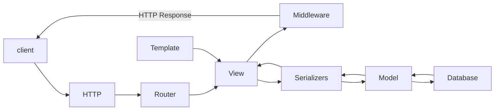

     
    <h1 align="center">Веб-сервис «TalentSpot»</h1>

### © ООО «ТАЛЕНТСПОТ»

TalentSpot — информационный сервис в виде интернет-портала, который связывает квалифицированных соискателей и работодателей для удовлетворения потребностей в рабочей силе, с внедрением алгоритмов автоматизации процесса найма кадров

> [!NOTE]\
> Проект находится на стадии разработки. 
> Сервис создается  при поддержке гранта <a href="https://fasie.ru/">Фонда содействия инновациям</a>, предоставляемого 
> в рамках программы «Студенческий стартап» федерального проекта <a href="https://univertechpred.ru/">«Платформа университетского технологического предпринимательства»</a>

## Стек технологий

  

  

## Версии 

apache + uwsgi

- Python version 3.12.0
- Django version 4.2.8
- Django rest framework version 3.14.0
- NodeJS version 18.12.1
- ReactJS version ^18.2.0
- Webpack version ^5.89.0

## Схема работы веб-сервиса

### © ООО «ТАЛЕНТСПОТ»

- ИНН – 2623034058
- КПП – 262301001
- ОГРН – 1232600016065
